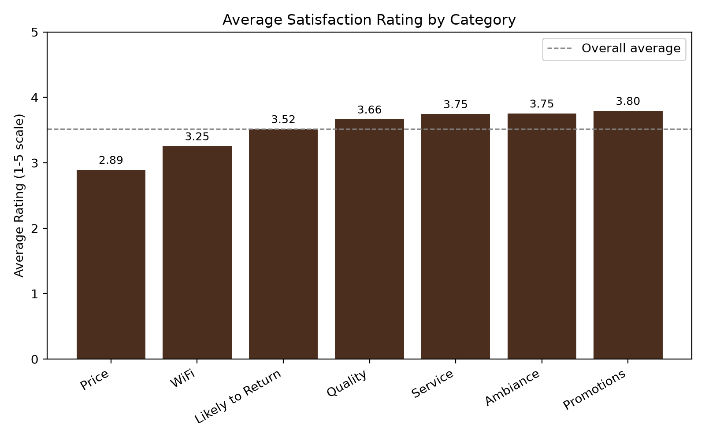
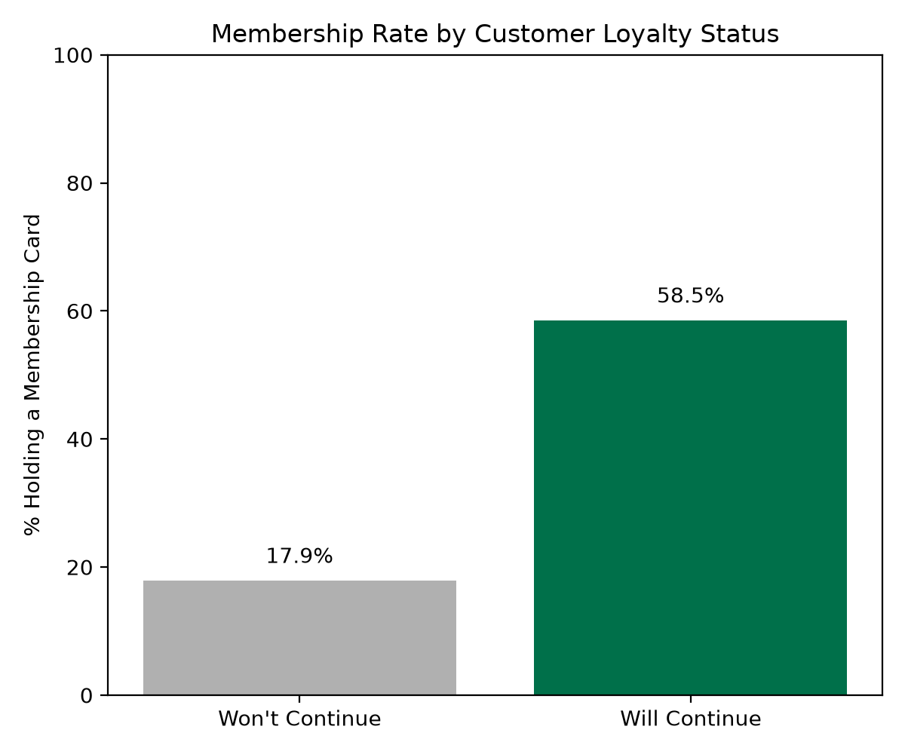

# Understanding Customer Satisfaction and Identifying What Drives Loyalty at Starbucks

**Morgan Gunther**  
**Professor Hammer**  
**BMIS 326: Introduction to Analytics**

## Executive Summary

Customer satisfaction has become a real problem for major coffee chains. A 2025 review analysis of over 6 million consumer reviews across 150,000 U.S. coffee shop locations found that satisfaction at big chains is nearly 30% lower than it was five years ago, driven by long waits, inconsistent service, and customers feeling they're not getting enough value (Evans, 2025). That's an opportunity for a company like Starbucks to figure out which parts of the customer experience matter most. Rather than treating "satisfaction" as one vague thing, this project breaks it down into specific, measurable categories. These are product quality, price, promotions, ambiance, WiFi, service, and likelihood to return. My goal is to identify which of these categories are driving customers away, and whether loyalty indicators, like membership enrollment, connect to specific satisfaction categories. Using a customer satisfaction survey of 122 Starbucks customers, this analysis found that price stands out as a clear weak point relative to every other category, and that membership enrollment shows a strong connection to whether a customer plans to keep buying. These findings point toward specific, fixable areas of focus rather than a vague sense that satisfaction is simply down, and could help Starbucks, or any coffee chain, prioritize real improvements and hold onto customers who might otherwise drift toward smaller, more personal coffee shops, which are gaining ground.

## Statement of Scope

This project is a descriptive analysis of customer satisfaction, looking at how satisfaction breaks down across different parts of the customer experience and whether it connects to loyalty indicators like membership enrollment or intent to keep buying. The data source is a customer satisfaction survey collected from Starbucks customers in Malaysia, hosted on Kaggle, a public platform for sharing datasets. The survey asks respondents to rate seven different parts of their experience on a 1 to 5 scale, along with demographic and behavior questions like age, membership card status, and whether they plan to keep buying from Starbucks.

**Project Objectives:**
- Calculate the average rating for each of the seven satisfaction categories (product, price, promotions, ambiance, WiFi, service, and likelihood to choose Starbucks again) to identify which areas customers rate highest and lowest.
- Determine what percentage of respondents who say they will continue buying from Starbucks also hold a membership card, to see if membership is connected to loyalty.
- Compare average satisfaction ratings across age groups to see whether certain age groups are consistently less satisfied than others.

My sample is the 122 respondents included in the survey. The population I'm hoping to speak to is Starbucks customers more broadly.

**Unit of Analysis:** My unit of analysis is the Customer. Since I'm assessing satisfaction with different parts of the Starbucks experience, a single customer, represented as one survey respondent, is what I'm measuring and comparing, not a store location, a product, or a transaction.

## Data Access & Consolidation

My data comes from a single source: the "Starbucks Customer Survey" dataset hosted on Kaggle ([https://www.kaggle.com/datasets/mahirahmzh/starbucks-customer-retention-malaysia-survey](https://www.kaggle.com/datasets/mahirahmzh/starbucks-customer-retention-malaysia-survey)). It contains 122 survey responses across 20 original questions. I chose this dataset because it's small, clean, and every question maps directly to something measurable and chartable, which matters given the scope of this project. Since I'm only using one data file, no merging was required. This project relies on a single data source rather than multiple merged files by design. Since my unit of analysis is the individual customer, and this survey already captures customer-level satisfaction and loyalty data directly, a single source was preferable to combining datasets with different units of analysis, such as a coffee shop revenue dataset I considered earlier that was measured at the daily-operations level rather than the individual-customer level. Most of the survey questions replaced the brand name with the generic term "Coffee House" instead of naming Starbucks directly, but one column (how respondents hear about promotions) still literally referenced "Starbucks Website/Apps," confirming the source of the data even though it wasn't labeled that way throughout.

## Data Reduction

I reduced the original 21 columns (20 survey questions plus a timestamp) down to 19. I removed two columns entirely:

- **Timestamp**: This had no analytical value for any of my three project objectives (average satisfaction by category, membership vs. loyalty connection, satisfaction by age group).
- **Question 19** (how respondents hear about promotions): While interesting, this column doesn't tie back to any of my stated objectives, so I removed it to keep the dataset focused.

I did not remove any rows. Every one of the 122 respondents is a legitimate member of the population I'm trying to understand (coffee chain customers). Nothing in this dataset gave me a reason to exclude any respondent. I saved my reduced dataset as a new file (sbux_reduced.csv) rather than overwriting the original, so the raw data is still available if I need to revisit a decision later.

## Data Cleaning

**Missing values:** Two columns had missing values, both minor. The "how do you usually enjoy Coffee House" question was missing one response out of 122 (0.8%). Rather than drop that respondent's entire row, which would throw away their answers to the other 19 questions over one skipped question, I recoded the missing value as "Unknown."

**Inconsistent categories:** The same "how do you usually enjoy" column had several values that were really saying the same thing but weren't standardized: "never, Never, Never buy" and "I don't like coffee" were all collapsed into a single consistent "Never" category. Before cleaning, this column had 8 distinct values, and after cleaning, it had 5.

**Erroneous/off-topic data:** The "what do you most frequently purchase" column had several responses that weren't real answers to the question at all, things like "Jaws chip, cake, Nothing, and Never buy any." These looked like confused or joke responses from people who don't actually purchase anything at the coffee shop. I recoded these into a single "Other/None" category rather than leaving them as scattered text values that would each show up as their own meaningless category in a breakdown. One case I left alone was a single response of "Cold drinks;Never," a contradictory multi-select answer (a question where respondents could pick more than one option). I chose not to touch this one, since "Cold drinks" is a legitimate purchase behavior and the stray "Never" selection looks more like an accidental click than a meaningful response, and it's only one row out of 122 either way.

**Data type checks:** I confirmed that all seven satisfaction rating columns (quality, price, promotions, ambiance, WiFi, service, and likelihood to return) were already stored as whole numbers on a 1-5 scale with zero missing values. I verified this directly in Python rather than assuming it, since it would've been easy to just say "nothing to clean here" without actually checking.

## Data Transformation

I renamed every column from the original long survey-question text (e.g., "12. How would you rate the quality of Coffee House compared to other brands...") to short, code-friendly names (e.g., Rating_Quality), since the raw question text is difficult to reference in code and tables.

I converted the Age column into an ordered category (Below 20 → 20-29 → 30-39 → 40 and above) instead of leaving it as plain text, so that any chart or table grouped by age sorts in a logical order instead of alphabetically.

Finally, I constructed a new variable, "Avg_Satisfaction," calculated as the mean of the seven individual rating columns for each respondent. This gives me a single overall satisfaction score per person, which is useful both for my descriptive statistics and for comparing satisfaction across groups like age, without needing to look at all seven categories separately every time.

## Data Dictionary

**Variable types used below:** *Categorical* = named groups with no inherent order (e.g., gender). *Ordinal* = categories with a natural order or ranking (e.g., age brackets, income brackets). *Binary* = only two possible values. *Numeric* = a measurable number.

| Variable | Description | Type | Values/Range |
|---|---|---|---|
| Gender | Respondent's gender | Categorical | Female, Male |
| Age | Respondent's age group | Ordinal | Below 20, From 20 to 29, From 30 to 39, 40 and above |
| Employment | Current employment status | Categorical | Employed, Student, Self-employed, Housewife |
| Income | Annual income bracket, measured in Malaysian Ringgit (RM), the currency used since this survey was collected from customers in Malaysia | Ordinal | Less than RM25,000 → More than RM150,000 |
| VisitFrequency | How often they visit | Ordinal | Never, Rarely, Monthly, Weekly, Daily |
| EnjoyMethod | How they usually consume | Categorical | Take away, Dine in, Drive-thru, Never, Unknown |
| VisitDuration | Time spent per visit | Ordinal | Below 30 min → More than 3 hours |
| NearestOutlet | Distance to nearest location | Ordinal | within 1km, 1km-3km, more than 3km |
| Membership | Holds a membership card | Binary | Yes, No |
| PurchaseType | What they typically buy | Categorical (multi-select) | Coffee, Cold drinks, Pastries, combinations, Other/None |
| SpendPerVisit | Typical spend per visit, in Malaysian Ringgit (RM) | Ordinal | Zero, Less than RM20, RM20-RM40, More than RM40 |
| Rating_Quality | Rating: product quality vs. competitors | Numeric (1-5 scale) | 1-5 |
| Rating_Price | Rating: price range | Numeric (1-5 scale) | 1-5 |
| Rating_Promotions | Rating: importance of promotions | Numeric (1-5 scale) | 1-5 |
| Rating_Ambiance | Rating: ambiance | Numeric (1-5 scale) | 1-5 |
| Rating_WiFi | Rating: WiFi quality | Numeric (1-5 scale) | 1-5 |
| Rating_Service | Rating: service quality | Numeric (1-5 scale) | 1-5 |
| Rating_LikelyReturn | Rating: likelihood to return | Numeric (1-5 scale) | 1-5 |
| Avg_Satisfaction | Constructed: mean of 7 rating columns | Numeric | 1-5 |
| Continue | Will keep buying | Binary | Yes, No |

## Descriptive Statistics

| Variable | Mean | Median | Std Dev | Min | Max |
|---|---|---|---|---|---|
| Rating_Quality | 3.66 | 4.00 | 0.94 | 1 | 5 |
| Rating_Price | 2.89 | 3.00 | 1.08 | 1 | 5 |
| Rating_Promotions | 3.80 | 4.00 | 1.09 | 1 | 5 |
| Rating_Ambiance | 3.75 | 4.00 | 0.93 | 1 | 5 |
| Rating_WiFi | 3.25 | 3.00 | 0.96 | 1 | 5 |
| Rating_Service | 3.75 | 4.00 | 0.83 | 1 | 5 |
| Rating_LikelyReturn | 3.52 | 4.00 | 1.03 | 1 | 5 |
| Avg_Satisfaction | 3.52 | 3.57 | 0.67 | 1 | 5 |

## Visualizations

### Story 1: Price Is the Weakest Category

With customer satisfaction with major coffee chains reportedly down nearly 30% over the last five years, the question isn't whether people are less happy, but why they are. Breaking satisfaction into seven specific categories instead of treating it as one vague feeling makes it possible to pinpoint exactly where that dissatisfaction is coming from. The chart below shows the average rating customers gave across all seven categories, sorted from lowest to highest.

Price stands out as the clear weak point, averaging 2.89 out of 5, nearly a full point below Promotions, the highest-rated category at 3.80. Every other category clusters fairly tightly around the overall average (the dashed line), which suggests this isn't a company struggling across the board. It's a company whose customers specifically feel like they aren't getting enough value for what they pay. That's a much more useful, fixable finding than a vague sense that "satisfaction is down," and it directly supports the idea that price, not product quality or service, is the biggest lever for improving how customers feel about the brand.

### Story 2: Membership Predicts Loyalty

One of the goals of this project was to figure out whether loyalty program participation actually connects to customers sticking around, or whether it's just a good thing to have that doesn't move the needle. To test this, I compared membership card ownership between two groups: customers who said they'll continue buying from the coffee chain, and customers who said they won't.

The gap is substantial. Among customers who plan to keep buying, 58.5% hold a membership card, compared to just 17.9% of customers who don't plan to continue, over a 3x difference. This suggests membership enrollment isn't just a side perk but it's meaningfully tied to whether a customer sticks with the brand. For a coffee chain trying to reduce churn (customers leaving to buy from a competitor instead) to smaller, more personal competitors, this points to a concrete strategy that getting more customers enrolled in the membership program could be one of the more direct ways to improve retention, rather than relying only on improving individual experience factors like price or service.

## Conclusion and Discussion (Deliverable 1)

My goal with this project was to break down customer satisfaction at a coffee chain into specific, measurable categories instead of treating it as one vague feeling, and to see whether that breakdown connects to loyalty indicators like membership enrollment. Based on this initial analysis, that approach is already paying off. Price stands out as a clear, specific weak point (2.89 out of 5, well below every other category), and membership enrollment shows a real connection to whether customers plan to keep buying (58.5% among loyal customers vs. 17.9% among those planning to leave). Again, these aren't vague impressions, they're specific, fixable signals that a business could act on.

Gathering and preparing this data came with a few struggles. The dataset required meaningful cleanup before it was usable. Inconsistent category labels (like never vs. Never vs. Never buy), a handful of off-topic or joke responses in the purchase-type question, and a small number of missing values. None of these were difficult to fix individually, but they required actually looking closely at the data rather than assuming a "clean" dataset from Kaggle was ready to go. If I were doing this again, I'd build in time earlier in the process specifically for auditing data quality before committing to a dataset, since I initially explored a few other datasets before landing on this one and only caught, through correlation checks, that some of them were randomly generated and not usable for real analysis. Starting with that kind of audit sooner would save time down the line.

In terms of implications, this kind of category-by-category breakdown matters beyond just this one company. Coffee chains broadly are dealing with declining satisfaction as customers increasingly consider smaller, more personal coffee shops instead. A business that can pinpoint price, specifically, rather than product quality or service, as its biggest satisfaction gap is in a much better position to make a targeted fix. Similarly, showing a real connection between membership enrollment and loyalty gives a business a concrete lever to pull (growing membership enrollment) rather than guessing at what keeps customers coming back. I hope this analysis, even at this early stage, shows that satisfaction and loyalty aren't unknowable areas. They can be broken into specific, addressable pieces with the right data.

## Reference

Evans, Russell. "Grounds for Concern: Why National Coffee Shop Chains Are Losing Steam." *ZS*, 25 Aug. 2025, [www.zs.com/insights/retail-coffee-trends-and-loyalty-insights](http://www.zs.com/insights/retail-coffee-trends-and-loyalty-insights).

# Deliverable 2

## Select Modeling Techniques

**Model 1: Multiple Linear Regression**

I'm using linear regression to explain how customer satisfaction changes based on membership status, visit frequency, and age group, to determine which of these factors actually relate to how satisfied a customer feels. This connects back to my original goal of understanding what drives satisfaction, extending Deliverable 1's finding that satisfaction breaks down unevenly across categories. Linear regression is the right fit here because my target variable, Avg_Satisfaction, is a continuous number rather than a category, and I want to understand the size and direction of each predictor's relationship, not just classify customers into groups.

Linear regression assumes a linear relationship between predictors and the outcome, independence of observations, normally distributed residuals, and no severe multicollinearity between predictors. I assessed the multicollinearity assumption directly using Variance Inflation Factors (VIF), since my three age dummy variables are related to each other by construction. All VIF values came back well under the common concern threshold of 5, so this assumption held up.

**Model 2: Logistic Regression**

I'm using logistic regression to estimate whether a customer will continue buying from Starbucks based on their membership status, satisfaction level, and visit frequency, to determine which of these factors are strongly predictive of customer loyalty. This connects directly to my original loyalty objective from Deliverable 1, where I found a gap in membership rates between loyal and non-loyal customers, and this model tests that relationship formally. Logistic regression is appropriate here because my target variable, Continue_Num, is binary (will continue vs. won't continue), not a continuous number, so linear regression wouldn't be the right tool.

Logistic regression assumes a linear relationship between the predictors and the log-odds of the outcome, independence of observations, and no severe multicollinearity. Given the same three predictors overlap conceptually with Model 1's cleaner set (no age dummies here), and Model 1 already confirmed low multicollinearity among the shared variables (Membership_Num, VisitFrequency_Num), I did not re-run a separate VIF check for this model.

## Build the Models: PRD

**1. Assignment overview**

| Item | Student response |
|---|---|
| Assignment name | Deliverable 2 Building Models |
| Main purpose of the assignment | Build two data models that extend the satisfaction/loyalty narrative from Deliverable 1: one predicting overall satisfaction, one predicting customer loyalty |
| Business, scientific, or practical question being answered | What factors predict how satisfied a Starbucks customer is, and what factors predict whether that customer will continue buying from Starbucks? |
| Expected final submission items | Python script, this PRD, and interpretation responses |

**2. Dataset information**

| Item | Student response |
|---|---|
| Dataset file name | sbux_modeling.csv |
| File type | CSV |
| What each row represents | An individual Starbucks customer survey respondent |
| Important columns or variables | Avg_Satisfaction, Continue_Num, Membership_Num, VisitFrequency_Num, Age dummy variables |
| Target variable, if applicable | Avg_Satisfaction (Model 1); Continue_Num (Model 2) |
| Predictor variables, if applicable | Membership_Num, VisitFrequency_Num, Age_20to29, Age_30to39, Age_40plus (both models); Avg_Satisfaction is also a predictor for Model 2 |
| Columns that should be removed | Original text versions of recoded columns (Age, Membership, Continue, VisitFrequency) — not needed once numeric versions exist |

**3. Required Python libraries**

| Library | Purpose |
|---|---|
| pandas | Data manipulation |
| statsmodels | Regression and logistic regression with full statistical output (p-values, R²) |
| matplotlib | Any supporting charts |
| sklearn | Train-test split, accuracy score, and confusion matrix for Model 2 |

**4. Data ingestion requirements**

Load sbux_modeling.csv using pandas.read_csv(). Script should print shape and confirm all needed numeric columns are present before modeling.

**5. Data cleaning requirements**

| Cleaning step | Reason |
|---|---|
| None | Data was fully cleaned and prepped in Deliverable 1 and the modeling-prep step |

**6. Data manipulation, filtering, and querying requirements**

No further manipulation needed. All required numeric/dummy variables already exist from the modeling-prep script. Script should just select the relevant columns for each model.

**7. Descriptive statistics requirements**

| Variable | Statistic needed | Reason |
|---|---|---|
| Membership_Num, Continue_Num, VisitFrequency_Num | Mean, minimum, maximum | Update Deliverable 1's descriptive stats table with new variables, per Deliverable 2 instructions |

**8. Regression requirements (Model 1)**

| Item | Student Response |
|---|---|
| Type of regression | Multiple linear regression |
| Dependent variable | Avg_Satisfaction |
| Independent variables | Membership_Num, VisitFrequency_Num, Age_20to29, Age_30to39, Age_40plus |
| Reason these variables are being used | Tests whether membership status, how often someone visits, and age group meaningfully predict overall satisfaction. This directly extends Deliverable 1's satisfaction objective. |
| Expected Output | Coefficients, intercept, p-values, R² |
| Interpretation Focus | Which predictors are statistically significant, direction of each relationship (does membership increase satisfaction? does visiting more often?), and how much of satisfaction these variables explain overall (R²). Also check for multicollinearity between predictors using VIF, since the three age dummy variables are related to each other by construction. |

**9. Classification requirements (Model 2)**

| Item | Student Response |
|---|---|
| Classification method | Logistic regression |
| Target variable | Continue_Num (will the customer keep buying: 1 = Yes, 0 = No) |
| Predictor variables | Membership_Num, Avg_Satisfaction, VisitFrequency_Num |
| Training/testing split, if required | 70/30 train-test split, with a fixed random_state (42) for reproducibility |
| Evaluation metrics | Accuracy, confusion matrix |
| Interpretation focus | Whether membership and satisfaction meaningfully predict loyalty, and how well the model correctly classifies customers as "will continue" vs. "won't continue" |

**10. Clustering requirements**

Not applicable.

**11. Visualization requirements**

| Visualization | Variables | Purpose |
|---|---|---|
| Confusion matrix heatmap | Actual vs. predicted Continue_Num | Show how well Model 2 classifies loyal vs. non-loyal customers |

**12. Output requirements**

- Script should print regression coefficients, intercept, p-values, and R² for Model 1
- Script should print accuracy and confusion matrix for Model 2
- Script should display the confusion matrix as a chart
- Script should print a summary comparing basic fit stats for both models (R² for Model 1, accuracy for Model 2)

**13. Testing plan**

| Test | Expected result |
|---|---|
| Confirm the file loads correctly | Script displays shape and correct column names |
| Check Model 1 output | Coefficients and R² print without errors |
| Check Model 2 output | Accuracy and confusion matrix print without errors |
| Check train/test split | Split proportions roughly match 70/30 |

**14. Interpretation questions**

- Which predictors in Model 1 are statistically significant, and what does each significant coefficient mean in plain terms?
- How much of the variation in satisfaction does Model 1 explain (R-squared), and is that a strong or weak result?
- Does Model 2 show that membership and/or satisfaction meaningfully predict customer loyalty?
- How accurate is Model 2 at correctly classifying customers, and where does it make mistakes (per the confusion matrix)?

**15. AI prompt based on the PRD**

I am completing a BMIS 326 Python analytics assignment. Use the PRD I attached to create a Python script. The script should follow the requirements, include comments, and produce outputs that help me answer the interpretation questions. Do not invent column names. If a required column is missing, include code that prints the available column names. Please read the PRD carefully, and then ask me any clarifying questions you need before you start coding. Important: Do not start writing code until we are both clear on all requirements and have answered all questions. Please:
1. Explain what you're doing at each major step
2. Show me the files you're creating
3. Let me know if you need any input from me
I'll let you work until you need my help or have something for me to test.

Follow-up: Are there any other questions you need answered before I test the code? What did I fail to think of?

## Results
MODEL 1: Linear Regression - Predicting Avg_Satisfaction
                        OLS Regression Results
==============================================================================
Dep. Variable:       Avg_Satisfaction   R-squared:                       0.131
Model:                            OLS   Adj. R-squared:                  0.094
Method:                 Least Squares   F-statistic:                     3.499
Prob (F-statistic):            0.00555
No. Observations:                 122
                     coef    std err          t      P>|t|      [0.025    0.975]

const                  3.1941      0.198     16.171      0.000       2.803     3.585
Membership_Num         0.2920      0.127      2.304      0.023       0.041     0.543
VisitFrequency_Num     0.1928      0.080      2.413      0.017       0.035     0.351
Age_From 20 to 29     -0.0877      0.195     -0.450      0.653      -0.473     0.298
Age_From 30 to 39     -0.0620      0.243     -0.255      0.799      -0.544     0.420
Age_40 and above      -0.1405      0.305     -0.461      0.645      -0.744     0.463

MODEL 2: Logistic Regression - Predicting Continue_Num
                       Logit Regression Results
==============================================================================
Dep. Variable:           Continue_Num   No. Observations:                  122
Model:                          Logit   Pseudo R-squ.:                  0.2821
Method:                           MLE   LLR p-value:                 4.432e-08
                     coef    std err          z      P>|z|      [0.025    0.975]

const                 -5.7243      1.723     -3.322      0.001      -9.101    -2.347
Membership_Num         1.0540      0.608      1.732      0.083      -0.138     2.246
Avg_Satisfaction       1.6176      0.509      3.181      0.001       0.621     2.614
VisitFrequency_Num     0.9942      0.529      1.881      0.060      -0.042     2.030
Training set size: 85 rows | Testing set size: 37 rows
Model 2 Accuracy on test set: 0.730
Confusion Matrix:
[[ 1  5]
[ 5 26]]

## Interpretation

**1. Which predictors in Model 1 are statistically significant, and what does each mean?**

Membership_Num and VisitFrequency_Num were both statistically significant predictors of satisfaction (p = 0.023 and 0.017 respectively), while the three age group variables were not (all p-values above 0.05). Both significant coefficients were positive, meaning members and more frequent visitors reported higher satisfaction on average, holding the other variables constant. Age did not show a meaningful relationship with satisfaction in this dataset.

**2. How much variation does Model 1 explain, and is that strong or weak?**

Model 1 explains about 13% of the variation in satisfaction (R² = 0.131), which is a modest, relatively weak result. The overall model is still statistically significant (F-statistic p = 0.00555), meaning the relationships found are real and not due to chance, but the majority of what drives satisfaction is clearly explained by factors outside this model, likely including price, quality, and service, the categories identified as influential in Deliverable 1.

**3. Does Model 2 show that membership and/or satisfaction meaningfully predict loyalty?**

Avg_Satisfaction was clearly statistically significant (p = 0.001) and strongly positive, meaning higher satisfaction is closely tied to a customer's likelihood of continuing to buy from Starbucks. Membership_Num (p = 0.083) and VisitFrequency_Num (p = 0.060) were both close to the standard 0.05 threshold but did not clear it, suggesting a possible but weaker relationship that this sample size may not be large enough to confirm with full statistical confidence.

**4. How accurate is Model 2, and where does it make mistakes?**

Model 2 correctly classified 73% of customers in the test set. However, the confusion matrix reveals an important limitation which is that the model correctly identified 26 of 31 customers who said they'd continue buying, but only 1 of 6 customers who said they wouldn't. This suggests the model is much better at recognizing loyal customers than at catching customers who are at risk of leaving, likely because the dataset itself is imbalanced (94 "will continue" vs. 28 "won't continue" respondents overall).

## Assess the Models

**Chosen assessment:** For Model 1, R² is the appropriate metric, since it directly measures what percentage of variation in a continuous outcome the model explains. For Model 2, accuracy and the confusion matrix are appropriate instead, since the outcome is categorical, not continuous.

**Strengths and weaknesses:**

Model 1 (Linear Regression):
- Strengths: Identifies two statistically significant, actionable predictors (membership, visit frequency); overall model is statistically significant; no multicollinearity concerns
- Weaknesses: Low R² means most of what drives satisfaction isn't captured; age added complexity without explanatory power

Model 2 (Logistic Regression):
- Strengths: Reasonably strong accuracy (73%); satisfaction is a clearly significant, strong predictor; higher pseudo R² than Model 1
- Weaknesses: Poor at catching customers who won't continue buying; membership and visit frequency were only borderline significant

**Final model justification:** While Model 1 offers useful supporting insight, Model 2 is the stronger and more useful model for this project's core narrative, since my original objectives centered on loyalty and retention, not satisfaction in isolation. Model 2 directly answers that question, showing satisfaction is a strong, significant driver of loyalty with reasonably strong accuracy. However, Model 2 has a real weakness which is that it's much better at identifying loyal customers than at catching customers about to leave, which matters most from a business standpoint. Model 1 helps explain part of why, since satisfaction itself is only modestly explained by membership and visit frequency.

**Final selection: Model 2**, with Model 1 serving as supporting analysis.

## Conclusion and Discussion (Deliverable 2)

This phase of the project extended the satisfaction and loyalty narrative from Deliverable 1 into two formal models. The first, a linear regression, found that membership status and visit frequency are both statistically significant predictors of overall satisfaction, though these factors only explain about 13% of the variation in satisfaction overall. The second, a logistic regression, found that satisfaction itself is a strong, statistically significant predictor of customer loyalty, correctly classifying 73% of customers in a held-out test set.

These findings point toward a concrete two-part strategy. Encouraging membership enrollment and repeat visits may genuinely improve satisfaction, and since satisfaction strongly drives loyalty, investments that improve satisfaction (like addressing the price concerns identified in Deliverable 1) are likely to pay off in actual retention.

This analysis has limitations, however. The dataset is relatively small (122 respondents), limiting generalizability. Model 1's low R² means most of what drives satisfaction remains unexplained, factors like price, quality, and service likely matter more than membership or visit frequency alone. Model 2's biggest limitation is its poor performance identifying customers who won't continue buying, likely due to class imbalance in the data. This means the model, as built, would be a poor tool for specifically flagging at-risk customers, arguably the most valuable use case for a loyalty model in practice.
